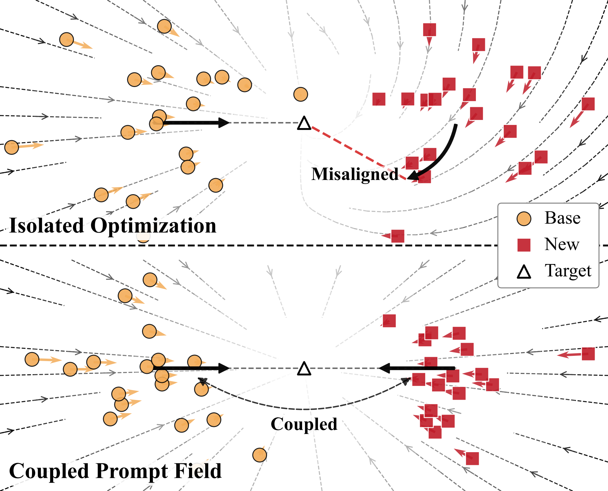
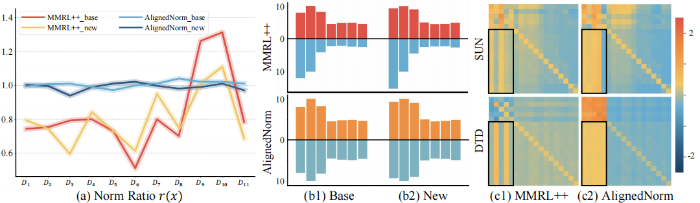
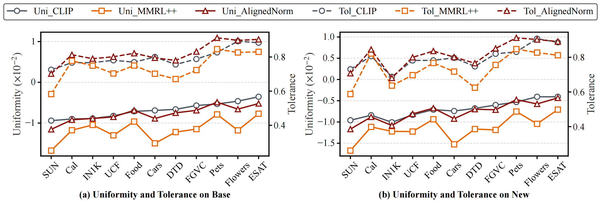
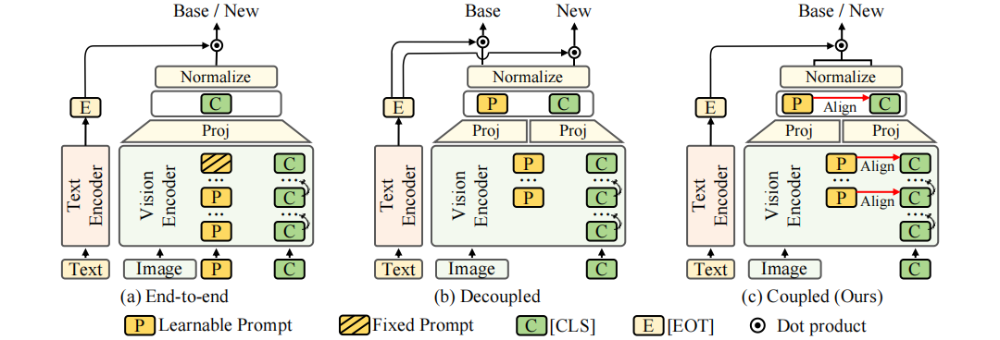

<h1 align="center">AlignedNorm: Prompting Vision–Language Models via <br> Coupled Prompt Field</h1>
<div align='center'>
    <a href= 'https://qbytem.github.io/' target='_blank'><strong>Qi Ma</strong></a><sup> 1,2</sup>,&thinsp;
    <a href= 'https://scholar.google.com/citations?user=N-qhfmYAAAAJ' target='_blank'><strong>Chen-Yang Wang</strong></a><sup> 1,2</sup>,&thinsp;
    <a href='https://scholar.google.com/citations?user=0uPb8MMAAAAJ' target='_blank'><strong>Dehong Gao</strong></a><sup> 3</sup>,&thinsp;
    <a href='https://scholar.google.com/citations?user=kakwJ5QAAAAJ' target='_blank'><strong>Deng-Ping Fan</strong></a><sup> 1,2,4*</sup>,&thinsp;
</div>

<div align='center'>
    <sup>1 </sup>VCIP & CS, Nankai University&ensp;  <sup>2 </sup>NKIARI, Shenzhen Futian&ensp; <sup>3 </sup>Northwestern Polytechnical University&ensp; <sup>4 </sup>SLAI&ensp;
</div>


<div>
    <h4 align="center">
        <a href="https://qbytem.github.io/alignednorm/" target="_blank">
            
        </a>
        <a href="https://qbytem.github.io/files/AlignedNorm_EN.pdf" target="_blank">
            
        </a>
        <a href="https://qbytem.github.io/files/AlignedNorm_CN.pdf" target="_blank">
            
        </a>
        <a href="https://qbytem.github.io/files/AlignedNorm_slide.pptx" target="_blank">
            
        </a>
        <a href="https://openreview.net/forum?id=aQAWAtrxxe" target="_blank">
            
        </a>
    </h4>
</div>


## News

- 🗓️ 2025/06/12: AlignedNorm code is released!  
- 🗓️ 2026/05/01: AlignedNorm is accepted by ICML 2026 🎉

## Introduction

Prompt learning has become an efficient way to adapt vision-language models (VLMs) to downstream tasks. However, existing end-to-end and decoupled methods often optimize base and new classes in isolated, task-specific feature spaces, which can lead to local optima and limited generalization.

We introduce **AlignedNorm**, a simple prompt-learning method built upon the concept of a **Coupled Prompt Field**. Instead of treating base and new classes independently, the coupled field places them in a shared optimization space where their learning dynamics mutually constrain each other. AlignedNorm realizes this coupling by dynamically aligning learnable prompts with the native feature scale of the pretrained VLM.

<p align="center">
  
</p>
<p align="center"><em>From isolated optimization to a Coupled Prompt Field shared by base and new classes.</em></p>

## Highlights

- **A new perspective on prompt learning.** We formulate base-to-new generalization through the Coupled Prompt Field, which encourages joint rather than isolated optimization.
- **Diagnosis of representation degradation.** We reveal that uncontrolled prompt learning causes **norm drift** and **Entanglement Collapse**, weakening the pretrained representation structure.
- **Simple and effective alignment.** AlignedNorm aligns prompt norms with the VLM's native feature scale at both intermediate and output levels, without introducing a complex architecture.
- **Better geometric preservation.** AlignedNorm maintains a more favorable balance between feature uniformity and semantic tolerance across base and new classes.

<p align="center">
  
</p>
<p align="center"><em>AlignedNorm mitigates norm drift and Entanglement Collapse during prompt learning.</em></p>

<p align="center">
  
</p>
<p align="center"><em>AlignedNorm better preserves the geometric structure of the pretrained representation space.</em></p>

## Method Overview

<p align="center">
  
</p>

As illustrated above, end-to-end methods optimize prompts within a single task path, while decoupled methods separate the optimization of base and new classes. In contrast, **AlignedNorm couples the two learning dynamics inside the vision encoder**. It aligns the norms of learnable prompt tokens with the corresponding native `[CLS]` representations at intermediate layers and further aligns their projected features at the output level. These lightweight alignment objectives keep prompt updates on the pretrained model's feature scale, reducing representation distortion while preserving transferable knowledge for both base and new classes.

## Running

All commands below should be executed from the project root directory. Before running an experiment, directly modify `DATA_ROOT` in the corresponding script under `scripts/alignednorm/`:

```bash
DATA_ROOT="/path/to/your/datasets"
```

The scripts that require this setting are:

- Base-to-Novel: `base2new_train.sh` and `base2new_test.sh`
- Cross-Dataset: `cross_datasets_train.sh` and `cross_datasets_test.sh`
- Few-Shot: `few_shot.sh`

By default, all scripts run three random seeds (`1`, `2`, and `3`) and summarize the results after completion.

### Base-to-Novel Generalization

Train on the base classes and evaluate the trained models on the new classes of all 11 datasets:

```bash
bash base_to_novel.sh
```

To run only one dataset, first train on its base classes and then evaluate on its new classes:

```bash
bash scripts/alignednorm/base2new_train.sh eurosat
bash scripts/alignednorm/base2new_test.sh eurosat
```

### Cross-Dataset Generalization

Train a 16-shot model on ImageNet and evaluate it on all target datasets:

```bash
bash cross_datasets.sh
```

To evaluate only one target dataset, run the training and evaluation stages separately:

```bash
bash scripts/alignednorm/cross_datasets_train.sh
bash scripts/alignednorm/cross_datasets_test.sh dtd
```

### Few-Shot Learning

Run the 1-, 2-, 4-, 8-, and 16-shot settings on all 11 datasets:

```bash
bash few_shot.sh
```

To run all shot settings on a single dataset:

```bash
bash scripts/alignednorm/few_shot.sh eurosat
```

### Running Specific Seeds

Use `SEEDS` before a command to run only the selected seed or seeds:

```bash
# Run only seed 1
SEEDS=1 bash scripts/alignednorm/few_shot.sh eurosat

# Run seeds 1 and 3 for Base-to-Novel
SEEDS="1 3" bash scripts/alignednorm/base2new_train.sh eurosat
SEEDS="1 3" bash scripts/alignednorm/base2new_test.sh eurosat

# Run the complete Cross-Dataset experiment using only seed 2
SEEDS=2 bash cross_datasets.sh
```

For Base-to-Novel and Cross-Dataset evaluation, use the same seeds for training and testing so that each evaluation script can locate its corresponding checkpoint. Existing output directories are skipped automatically; remove or rename the corresponding directory under `output/` to rerun an experiment.

## 📅 TODO

- [x] Release code.
- [ ] Release model weights and corresponding log files.

## Contact 
If you have any questions, you can submit an [issue](https://github.com/QByteM/AlignedNorm/issues) on Github, or contact me by email (nkucsmq[at]gmail.com).

## Acknowledgements
This codebase builds on [MMRL/MMRL++](https://github.com/yunncheng/MMRL) and [clip_text_span](https://github.com/yossigandelsman/clip_text_span). 


## Citation

If you find our paper or repo helpful for your research, please consider citing our paper and giving this repo a star⭐. Thank you!

```
@inproceedings{ma2026alignednorm,
  title={AlignedNorm: Prompting Vision–Language Models via Coupled Prompt Field},
  author={Ma, Qi and Wang, Chen-Yang and Gao, Dehong and Fan, Deng-Ping},
  booktitle={ICML},
  year={2026}
}
```
